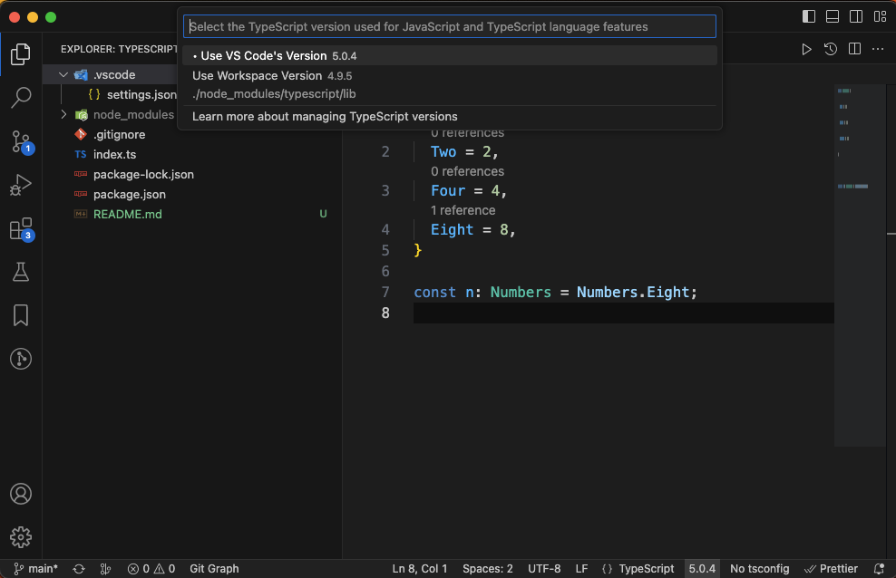

# source code for presenting what's new in typescript 5

## In this repo
- speed and performance
- breaking changes
- switch/case auto complete
- tsconfig extends is now array
- enum overhaul
- forbidden implicit coercions in relational operators
- @overload in jsdoc
- @satisfies in jsdoc
- Passing Emit-Specific Flags Under --build

## How to change the vs-code typescript version?
Open a ts file then
change the version from the status bar

